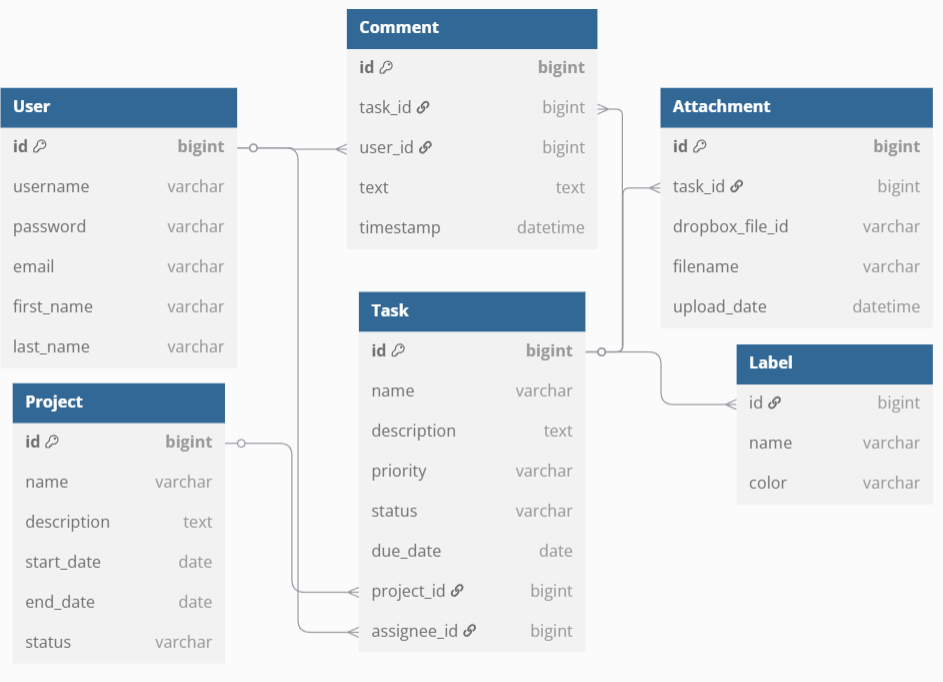

# Task management

Task Management App is a portfolio project for organizing tasks and projects.
Users can create projects, add tasks, and assign them to other users.

Key Features:
* Create and manage projects and tasks;
* Assign tasks to other users (assignees);
* Email notifications when a task is assigned, updated, or deleted;
* Upload, download, and delete task-related files using cloud storage (Dropbox);

## Model diagram

## Tech Stack & Dependencies
    
### Java & Spring

    Java: 17
    Spring Boot:3.4.4
    Spring Data JPA
    Spring Security
    Spring Web
    Spring Validation
    Spring Boot Mail Starter
    SpringDoc OpenAPI: 2.8.4

### Database
    
    MySQL Connector/J (runtime)
    H2 Database (for tests/runtime)
    Liquibase: Schema versioning tool

### Testing

    Spring Boot Starter Test
    Spring Security Test
    Spring Boot Testcontainers
    Testcontainers (MySQL)

### Functional

User capabilities:

1. Register and log in.
2. View all projects, tasks, labels and user info.
3. Change current user's info.
4. Upload, download and delete files in cloud storage.
5. Get info about task's changes by email`s notifications.

Admin capabilities:

1. Update user`s role.
2. Create, update and delete projects/tasks/labels.

### Task management`s endpoints

    Auth (/auth):
        GET: /registration - Register a new user
        GET: /login - Retrieve a token for Bearer authentication

    Users (/users):
        GET: /me - Retrieve current user's profile
        PATCH: /me - Update current user's profile
        PATCH: /{id}/role - Update a user's role by ID (ADMIN only)

    Projects (/projects):
        GET: / - Retrieve paginated list of projects
        POST: / - Create a new project (ADMIN only)
        PUT: /{id} - Update a project by ID (ADMIN only)
        GET: /{id} - Retrieve a project by I
        DELETE: /{id} - Soft delete a project by ID (ADMIN only)

    Tasks (/tasks):
        GET: / - Retrieve paginated list of tasks
        POST: / - Create a new task and notify assignee (ADMIN only)
        PUT: /{id} - Update a task and notify assignee (ADMIN only)
        GET: /{id} - Retrieve a task by ID
        DELETE: /{id} - Soft delete a task by ID (ADMIN only)

    Attachments (/attachments):
        POST: / - Upload file to cloud storage and save info
        GET: / - Retrieve paginated list of attachments by task
        DELETE: /{id} - Delete attachment from DB and cloud storage
        
    Labels (/labels):
        GET: / - Retrieve paginated list of labels
        POST: / - Create a new label (ADMIN only)
        PUT: /{id} - Update a label by ID (ADMIN only)
        DELETE: /{id} - Soft delete a label by ID (ADMIN only)
    
    Comments (/comments):
        POST: / - Add a comment to a task
        GET: / - Retrieve paginated list of comments by task ID

### Running Task management project

**Docker:**

1. Install Docker Desktop (if not installed).

2. Configure the .env file with your settings.

3. Open dropbox [site](https://www.dropbox.com/developers/apps/):
    1. Open or create your dropbox project.
    2. In permissions set:

       1. [X] files.content.write
       2. [X] files.content.read

    3. Then generate access token.
    4. In application.properties set:
`dropbox.token=your_generated_dropbox_token.`

4. In application.properties write your real email and password:

`spring.mail.username=your@gmail.com`
`spring.mail.password=your_password` 
    
* Can be needed:
  * Go to [Gmail security page](https://myaccount.google.com/security#signin).
  * Find 2 step verification from there. open it.
  * Select "Turn off"

5. Open the terminal and run the following commands:

    docker-compose build  # Build the images
    
    docker-compose up     # Start the project
    
    docker-compose down   # Stop the project

6. After starting the web server, download Task management.postman_collection.json(in README_FILES).

7. Import it into Postman to test the functionality.

**Running Locally**

Open application.properties.

1. Set the required database properties:

    `Database URL`

    `Username`
    
    `Password`

2. Same algorithm as docker: 3 - 4.

3. Run application.

**In conclusion**, I gained solid experience building a full-featured REST API.
I also integrated external services like Dropbox and Email APIs.
The most challenging part was implementing authentication and the security filter chain.
You can check out a short [video](https://www.loom.com/share/fd774d9369da42e8bda22e6e15df59e5) showing how the app works.
